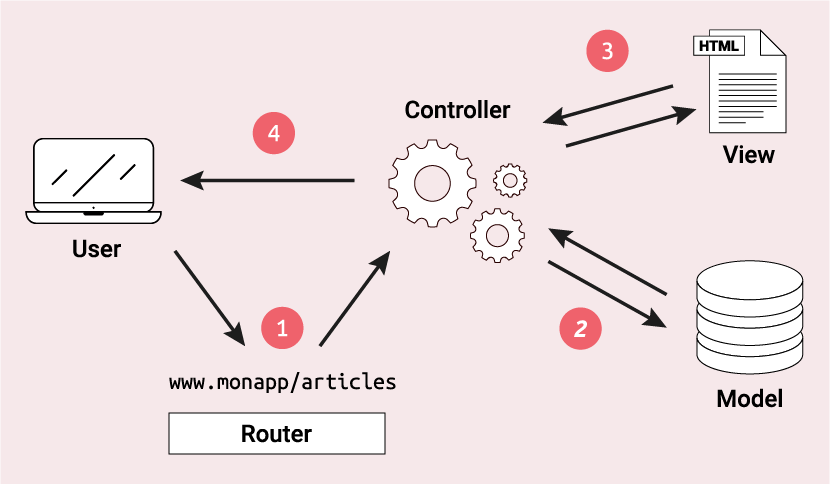
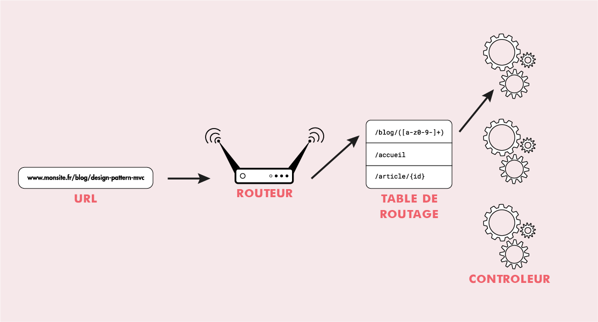

# Model Vue Controleur

## Introduction
---
Le modèle MVC est un design pattern, qui décrit la manière d'architecturer une application "informatique" en la décomposant en trois partie.

- La partie **Modèle**
- La partie **Vue**
- La partie **Controleur**

> *Un design pattern(patron de conception) est un ensemble de solution connues pour des problèmes classique de programmation. <br> Exemple de design : Singleton, factory, router, mvc ...*

## Rôles des différentes parties
---

**Modèle** : Cette partie va gèrer la couche métier *(business métier, logique métier)*. Son rôle est de récupérer les informations dans la base de données, de les organiser, assembler pour qu'elles puissent être envoyer au **Controleur**. 

Si l'on prend une application de gestion, la couche métier va englober la gestion des comptes(création, modification, supression...), calculs des soldes ... 

Par exemple c'est dans cette partie que l'on retrouvera nos requêtes SQL.

**Vue** : Cette partie va gèrer l'affichage des informations envoyés par le **Model**. Par exemple les éléments suivant : 

- générer du HTML
- générer du XML
- générer un PDF

Dans notre cas on y retrouvera principalement du HTML avec des boucles, conditions PHP pour afficher nos informations. 

**Controleur** : Cette partie va gèrer la dynamique de l'application. Elle va faire le lien entre **l'utilisateur** et le reste de **l'application**.

Le Controleur va s'occuper de récupérer les données du **Modèle**, collecter les données des formulaires, appeler les éléments de **Vue**.


Exemple d'action :

- Afficher une page web avec ou sans données
- Soumettre un formulaire
- Demander la génération d'un document PDF
- Trier des données d'un tableau via un clic sur les en-têtes des colonnes
- Récupérer les données au format JSON

<p style="text-align: center"></p>

## Router
---

L'idée derrière le **Router** est de définir un unique point d'entrée dans notre application et de rediriger toutes les URLs vers cette entrée. Cela va nous permettre de centralisé les éléments essentiels au bon fonctionnement de notre application *(Fichier config, autoloader, connexion à la BDD, constantes ...)*, utiliser des URLs personnalisées. 

### Fonctionnement

<p style="text-align: center"></p>

Le **router** va analyser l'URL pour obtenir une **route**, il va ensuite regarder dans la table de routage(un ensemble de motifs de route *ex: /blog/([a-z0-9_-]+)* ) si la route existe puis il va envoyer une réponse au navigateur. Dans le cas où aucune route n'est défini pour l'URL alors l'application repondera ERROR 404 NOT FOUND.

> *Dans ce cours nous ne développerons pas de router. Nous nous contenterons de récupérer une bibliothèque.*

Table de routage Symfony YAML :

``` yaml
# config/routes.yaml
blog_list:
    path: /blog
    controller: App\Controller\BlogController::list

api_post_show:
    path: /api/posts/{id}
    controller: App\Controller\BlogApiController::show
    methods: GET|HEAD
```

Table de routage Laravel PHP :

```php
Route::get('/article', 'ArticleController@index');
Route::get('/article/{id}', 'ArticleController@show');
```

## Avantages 

* Séparation claire des reponsabilités au sein d'une application, séparer la logique métier, dynamique de l'application et l'interface utilisateur(UI).

* Permet de travailler à plusieurs en parallèle sans se géner. 

* La réutilisabilité et gain de temps, permet de fabriquer des composants UI qui encouragent à la réutilisation. Il élimine la répétitions de code et améliore sa réutilisation et maintenabilité.

## Inconvénient 

* Difficultés de conception cependant, le prix à payer est une augmentation de la complexité de l’architecture. Il est important de savoir que cette architecture présente des difficultés de conception qui peuvent se présenter au moment de l’implémentation lorsque les différentes équipes ne sont pas coordonnées surtout au niveau de l'interfacage des couches.

* Un nombre énorme de fichiers à manipuler, en fait la séparation des différentes couches nécessite la création de plus de fichiers (3 fois pour les différentes couches). Mais pour des projets de grandes envergures, ce détail semble moins pertinent, si la conception a été bien faite


